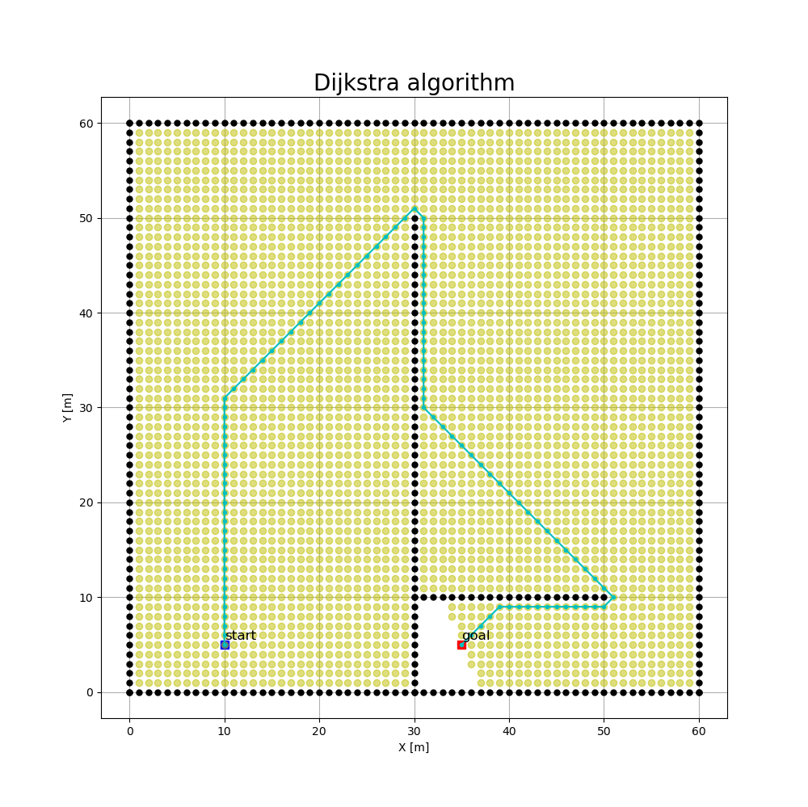
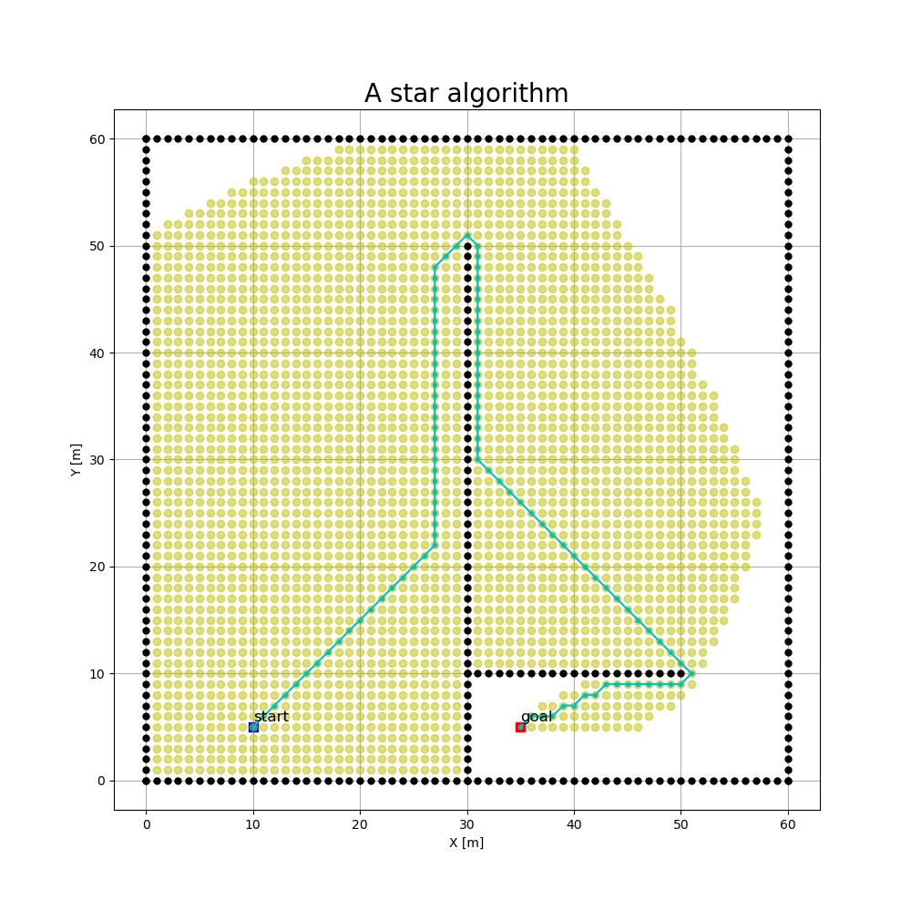
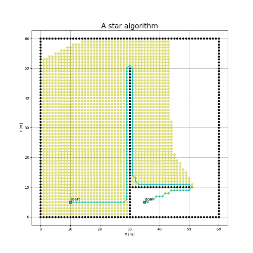
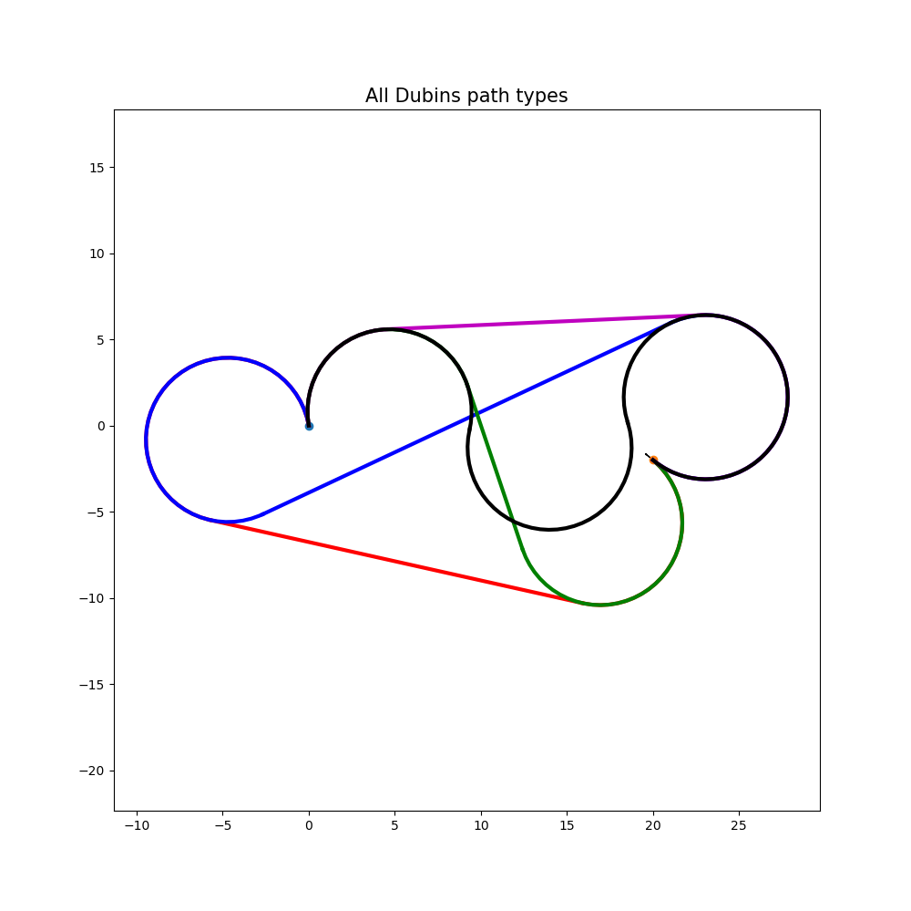
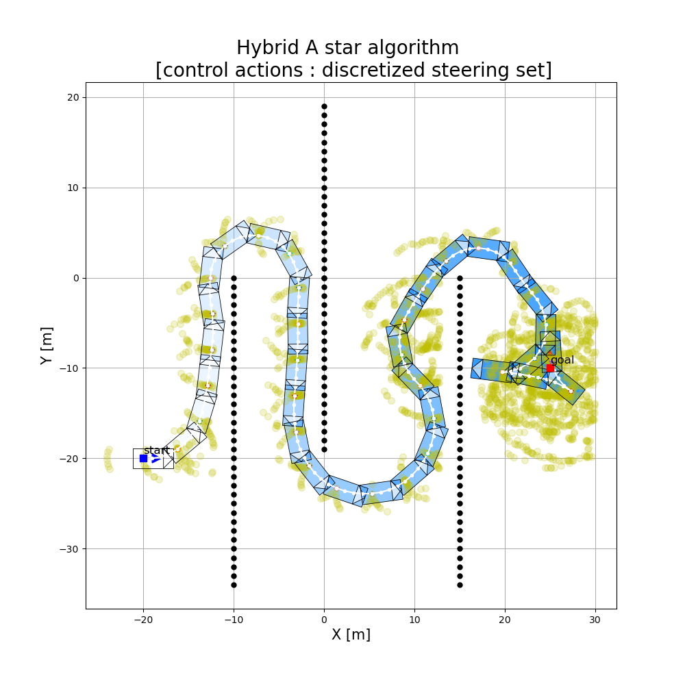
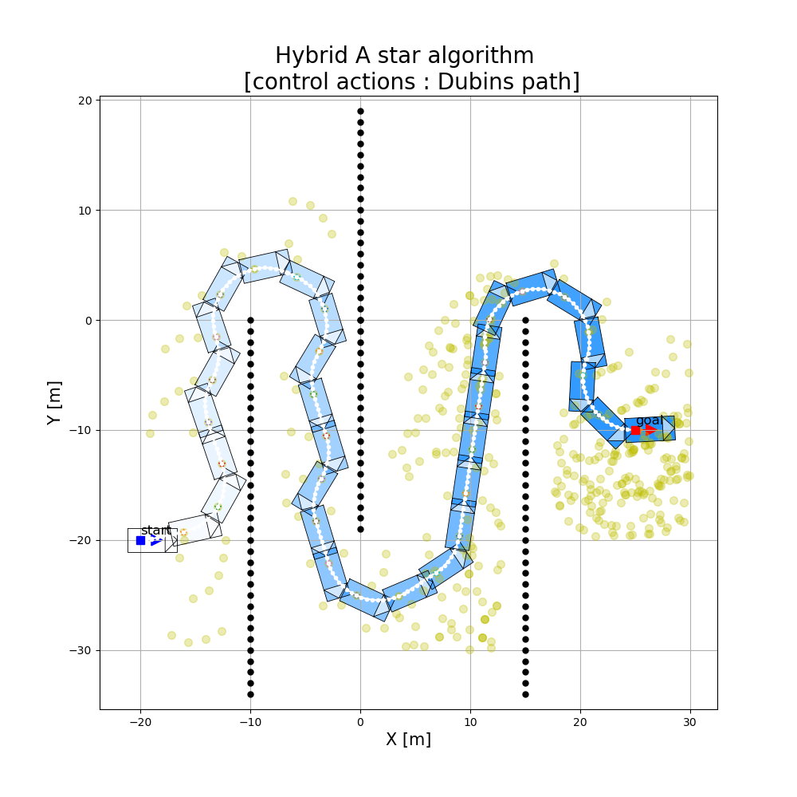
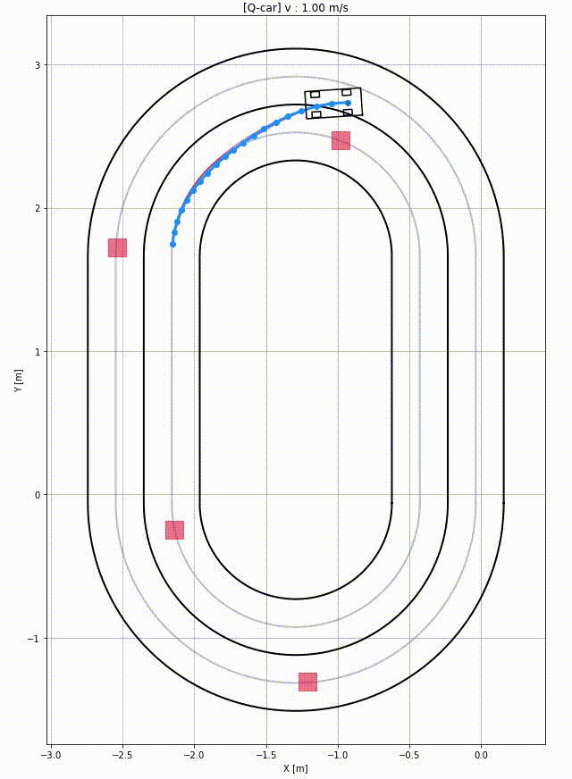

# Planning Algorithms

Python codes for planning algorithms

# Contents
- Dijkstra algorithm
- A* algorithm
- Weighted A* algorithm
- Dubins Path
- Optimal Trajectory in Frenet Frame (polynomial)

# Dijstra algorithm

# A* algorithm

# Weighted A* algorithm

# Dubins path

# Hybrid A* w/ steering angle set

# Hybrid A* w/ Dubins path

# Optimal trajectory in Frenet frame

# Reference
- https://github.com/karlkurzer/path_planner
- https://github.com/dawnjeanh/motionplanning
- https://github.com/AtsushiSakai/PythonRobotics

